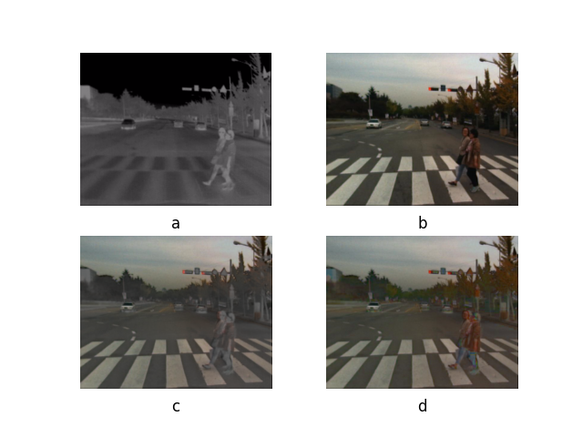

[densefuse](https://ieeexplore.ieee.org/document/8580578)复现，\
参考 https://github.com/hli1221/densefuse-pytorch \
本机没有 gpu，用 CIFAR-10 和 TNO 数据集代替 COCO2014 在本地训练\
白嫖 colab 的 gpu 资源时，在运行 densefuse.ipynb 之前，需自行上传依赖包并下载 COCO 数据集\
红外-可见光融合结果：\
\
(a)Infrared image;(b)Visible image;(c)cifar-add;(d)cifar-l1_norm;(e)cifar-tno-add;(f)cifar-tno-l1_norm.

彩色图像融合结果： \
)\
(a)Infrared image;(b)Visible image;(c)RGB-fuse;(d)HSV-fuse.

客观评价：

| methods                  | $E_n$  | $Q_{abf}$ | $SCD$  | $FMI_w$ | $FMI_{dct}$ | $SSIM_a$ | $MS\_SSIM$ |
| ------------------------ | ------ | ------ | ------ | ------ | ------- | ------ | ------ |
| cifar-add                | 6.1686 | 0.3304 | 1.6270 | 0.4130 | 0.4029  | 0.7782 | 0.8695 |
| cifar-l1_norm            | 6.3521 | 0.4209 | 1.6410 | 0.4152 | 0.3816  | 0.7703 | 0.8484 |
| cifar-tno-add            | 6.1112 | 0.3276 | 1.6012 | 0.4140 | 0.4037  | 0.7783 | 0.8616 |
| cifar-tno-l1_norm        | 6.2871 | 0.4237 | 1.6165 | 0.4176 | 0.3828  | 0.7709 | 0.8415 |
| coco2014-add             | 6.1344 | 0.3338 | 1.5800 | 0.4055 | 0.3920  | 0.7697 | 0.8505 |
| coco2014-l1_norm-sum     | 6.3576 | 0.4239 | 1.5837 | 0.4091 | 0.3634  | 0.7598 | 0.8249 |
| coco2014-l1_norm-softmax | 6.6619 | 0.4964 | 1.5200 | 0.4492 | 0.3036  | 0.7188 | 0.7772 |